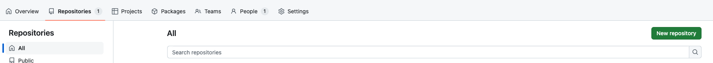
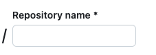
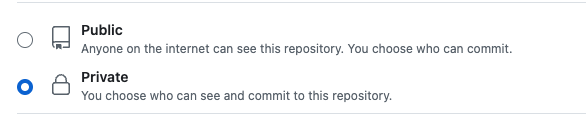
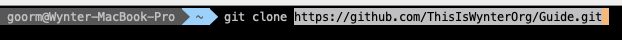

# 가이드 레포지토리

이 레포지토리는 수강생분들을 위한 가이드 레포지토리입니다. 해당 가이드라인을 참고하여 레포지토리를 생성하고 팀프로젝트를 진행해주세요.

> 💡 Organization이란?

깃허브에서 팀이나 회사처럼 함께 작업하는 사람들을 위해 제공하는 서비스.

> 💡 Github Repository란?

깃허브에서 제공하는 폴더라고 생각하면 편합니다.

프로젝트의 파일과 이력 정보를 저장하는 곳을 Repository(저장소) 라고 합니다.

## 레포지토리 생성하는 법

Repositories 탭을 누른 후, New Repository 버튼을 클릭해주세요.



Respository name의 경우 아래 형식을 지켜 작성 부탁드립니다. 
```
풀스택 : 과정명-회차-프로젝트 ex.<fullstack-07-project-fe>, <fullstack-07-project-be>
정보보호 : 과정명-회차-프로젝트 ex.<security-06-project>
```



Public과 Private를 선택하실 수 있습니다. Public으로 하면 전세계 모든 인원이 해당 레포지토리를 열람할 수 있는 권한이 생깁니다.



Create repository 버튼을 눌러 레포지토리 생성을 완료합니다.

## 로컬에 레포지토리 클론하기

방금 생성한 레포지토리는 깃허브 서버에만 있고, 내 컴퓨터에는 없는 상태입니다.

이를 내 컴퓨터에 다운 받는 과정을 "클론"이라고 합니다.

이 과정을 하기 위해서는 git 소프트웨어를 설치하셔야합니다. [링크](https://git-scm.com/downloads)를 참고하여 깃을 설치해주세요.

다운 받고 싶은 로컬 경로에서 `git clone 깃주소` 명령을 치면, 로컬에 깃 클론이 됩니다.

이때 깃 주소는 본인이 방금 만든 레포지토리의 깃 주소를 사용하셔야합니다.



## 커밋하기

파일의 변경 사항을 기록하는 작업을 커밋(Commit)이라고 합니다.

로컬에 클론한 레포지토리에서 작업을 한 뒤, `git add .` 명령을 입력하여 커밋 대상으로 파일들을 스테이징 서버에 올립니다.

`git commit -m 'first commit'` 명령을 입력하여 로컬 저장소에 작업을 커밋합니다.

## 푸시하기

원격 저장소(github repository)에 작업을 올리는 것을 푸시(Push)라고 합니다.

`git push` 명령을 쳐서 main 브랜치에 푸시해주세요.

> 💡 Branch란?

Branch는 Git에서 독립적인 작업을 할 수 있도록 해주는 개념으로, 메인 코드베이스와 분리된 상태에서 개발을 할 수 있게 합니다. 각 브랜치는 서로 영향을 주지 않으며, 작업이 완료되면 메인 브랜치에 병합(Merge)할 수 있습니다. 이를 통해 여러 기능이나 버전을 동시에 개발하고 관리할 수 있습니다.

## PR하기

원활한 협업을 위해서는 PR이 필수입니다. PR(Pull Request)는 변경한 내용을 특정 브랜치에 병합 해 달라고 요청하는 기능입니다.

`git checkout -b readme` 명령을 쳐서 브랜치를 생성하고 이동합니다.

작업 후 원격 저장소에 커밋, 푸시 해둡니다.

깃허브에서 pr을 생성하여 올리면 됩니다.

해당 과정은 협업하면서 직접 해보세요!
